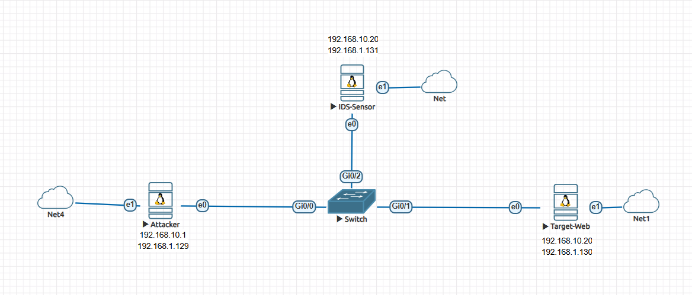
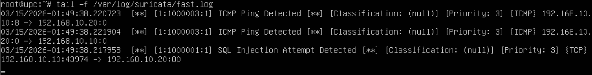

# Stealth-IDS-Pipeline
EVE-NG 기반 OOB(Out-of-Band) 네트워크 관제 시스템 및 스텔스 IDS 구축 프로젝트



## 프로젝트 개요 (Overview)
본 프로젝트는 엔터프라이즈 환경에서 보안 관제 시스템의 존재를 은닉하기 위해 **Out-of-Band(OOB) 대역 외 관리망**과 **스텔스(Stealth) 인터페이스** 기법을 적용하여 설계된 침입 탐지 시스템(IDS) 인프라 구축 사례입니다.

EVE-NG 가상화 환경을 활용하여 L2 스위치 포트 미러링(SPAN) 구성, 오픈소스 IDS(Suricata) 커스텀 룰 튜닝, 공격 시뮬레이션(SQLi, 리콘)을 통한 실시간 탐지 검증까지 인프라 보안의 전 과정을 직접 설계 및 구현하였습니다.

### 주요 적용 기술 (Key Skills)
- **Network Architecture**: EVE-NG 인프라, L2 Switch Port Mirroring (SPAN), OOB 관리망 설계
- **Linux Security**: Ubuntu Server 하드닝, Promiscuous Mode 제어, Stealth NIC 설정
- **Threat Detection**: Suricata IDS 운영, 사용자 정의 탐지 룰(Custom Rule) 작성
- **Offensive Security**: Nmap 포트 스캐닝, SQL Injection 스크립트 작성

---

## 아키텍처 설계 (Architecture Design)

네트워크는 서비스망(10.x.x.x)과 관리망(192.168.x.x)으로 물리적/논리적 분리가 되어 있습니다.

| Node | Name / Role | Internal IP (Web/Attack) | Management IP (SSH) | OS |
| :--- | :--- | :--- | :--- | :--- |
| **A** | `Attacker` (공격자) | `10.10.10.101` (e0) | `192.168.1.129` (e1) | Ubuntu 22.04 LTS |
| **B** | `Target-Web` (보호 웹서버) | `10.10.10.200` (e0) | `192.168.1.130` (e1) | Ubuntu 22.04 LTS |
| **C** | `IDS-Sensor` (탐지 서버) | **Stealth Mode (IP 없음)** (e0) | `192.168.1.131` (e1) | Ubuntu 22.04 LTS |

> **설계 주안점 (Stealth Mode)** 
> IDS 서버의 스니핑용 인터페이스는 공격자가 Ping Sweep이나 포트 스캔으로 방어 장비의 존재를 식별하지 못하도록, OS 레벨에서 IP 할당을 제거(ifconfig down & ip addr flush)하고 수신 전용 Promiscuous 모드로 동작하도록 구성했습니다.

---

## 구축 과정 및 설정 (Implementation)

### 1. EVE-NG L2 Switch: Port Mirroring (SPAN) 설정
L2 스위치에서 외부 공격자와 내부 웹서버 간의 통신(Gi0/0, Gi0/1)을 IDS 센서(Gi0/2)로 복사하여 전달하도록 설정합니다.

```text
! Cisco Switch SPAN Configuration
enable
configure terminal
monitor session 1 source interface Gi0/0 both
monitor session 1 source interface Gi0/1 both
monitor session 1 destination interface Gi0/2
```

### 2. IDS-Sensor: Suricata 룰 튜닝
`local.rules` 파일을 직접 작성하여 빈번하게 발생하는 공격 패턴을 탐지합니다.

```suricata
# /etc/suricata/rules/local.rules
alert http any any -> any 80 (msg:"[CRITICAL] SQL Injection Attempt Detected"; content:"union select"; nocase; sid:1000001; rev:1;)
alert tcp any any -> any 80 (msg:"[WARNING] NMAP Scan Detected"; content:"GET / HTTP/1.0"; depth:14; sid:1000002; rev:1;)
alert icmp any any -> any any (msg:"[INFO] ICMP Ping Sweep Detected"; sid:1000003; rev:1;)
```

### 3. 공격 시뮬레이션
`Attacker` 노드에서 Bash 스크립트를 작성하여 악성 트래픽을 타겟 서버로 전송합니다.

```bash
#!/bin/bash
# attack_test.sh
echo "[*] Sending SQL Injection Attack..."
curl -s -d "username=admin' union select 1,2,3--&password=123" http://10.10.10.200/login.php > /dev/null

echo "[*] Sending Ping (ICMP) Attack..."
ping -c 2 10.10.10.200 > /dev/null

echo "Done!"
```

---

## 검증 및 탐지 결과 (Verification & Logs)

공격 발생 시 OOB 망을 통해 IDS 서버의 `/var/log/suricata/fast.log`에서 시그니처 매칭 로그를 확인합니다.

 

```log
03/14/2026-11:35:01.123456  [**] [1:1000001:1] [CRITICAL] SQL Injection Attempt Detected [**] [Classification: Web Application Attack] [Priority: 1] {TCP} 10.10.10.101:54321 -> 10.10.10.200:80
03/14/2026-11:35:02.987654  [**] [1:1000003:1] [INFO] ICMP Ping Sweep Detected [**] [Classification: Misc activity] [Priority: 3] {ICMP} 10.10.10.101:8 -> 10.10.10.200:0
```

---

### 트러블슈팅 (Troubleshooting)
- **이슈:** 초기 구성 시 IDS 센서에서 패킷이 관측되지 않음.
- **원인 및 해결:** L2 Switch의 SPAN 설정 누락 확인. 스위치 미러링 설정(monitor session)을 통해 물리적으로 트래픽이 복사되도록 조치 후 탐지 정상화.

## License
MIT License
